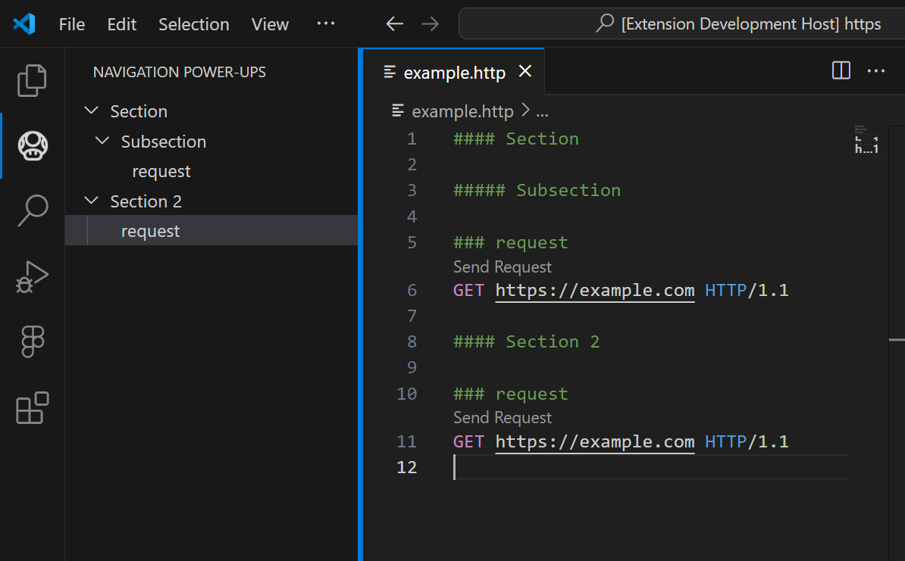

# Navigation Power-ups - VS Code Extension

## Overview ...

**Navigation Power-ups** is a Visual Studio Code extension that enhances your file navigation experience by adding a left bar navigation tree to files that haven't it natively. The extension is designed to support a variety of file types, offering an easy-to-use interface for jumping between sections, headers, or requests within supported files.

Currently, the extension supports `.http` files, with plans to extend compatibility to Markdown files (`.md`) and others in the future.

## Features

- **Navigation for Supported Files**: Automatically builds a navigation bar for specific file types, allowing for quick and easy access to different sections, headers, or requests within the file.


## Supported File Types

| File Type | Description                                      | Navigation Rules                                                                 |
|-----------|--------------------------------------------------|----------------------------------------------------------------------------------|
| `.http`   | HTTP request files                               | Navigation based on `###` for requests. Headers with more than `###` are sections.|
| `.md`     | Markdown files *(Upcoming)*                      | Navigation based on `#`, `##`, `###`, etc. headers.                              |
| More      | Additional file types *(Planned for future)*     | TBD                                                                              |

## Setup

1. **Install the Extension**: Search for "Navigation Power-ups" in the VS Code marketplace and install the extension.
   
2. **Open a Supported File**: Open a `.http` file in your workspace, and the extension will automatically generate a navigation tree in the side panel. Each section or request will appear as a navigable node.

3. **Navigate Through the File**: Click on any node in the navigation tree to jump directly to that section or request in the file.

4. **Real-time Updates**: As you make changes to the file (such as adding new sections, editing headers, or removing requests), the tree will update in real time to reflect these changes.

### HTTP Files

In `.http` files, the extension uses the number of `#` characters to differentiate between sections and requests:

- **Sections**: Any headers with more than three `#` characters (e.g., `#### Section`) are treated as higher-level sections.
- **Requests**: Headers with exactly three `#` characters (e.g., `### request`) are treated as individual HTTP requests.

### Example of `.http` file structure:



```http
#### Section

##### Subsection

### request
GET https://example.com HTTP/1.1

#### Section 2

### request
GET https://example.com HTTP/1.1

``` 

In this example, the navigation tree will display "Section" and "Section 2" as parent nodes, with each `GET` request listed underneath.


## License

This extension is licensed under the MIT License.
